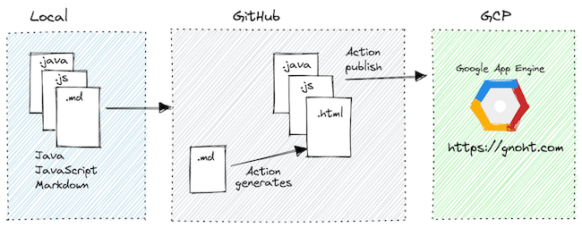

A collection of things I've learned in the form of code snippets, notes, and mini demo applications. 

Infrastructure wise it's a [Quarkus application](https://quarkus.io/) that serves a static site, and API for some application logic to run demos, all running on [Google App Engine](https://cloud.google.com/appengine).

The workflow goes something like this:

* I edit and preview Markdown locally
* optionally I can add any application logic for demos since it's just a Java app
* push my changes to GitHub where an [action](/today-i-learned/blob/main/.github/workflows/build-deploy-appengine.yml) run a [Python script](/today-i-learned/blob/main/deploy/static-site/generate.py) to:
  1. parse the Markdown and generate a static site
* finally the GitHub action publishes the newly generated static files and application logic to [Google App Engine](https://cloud.google.com/appengine) as a Quarkus application

